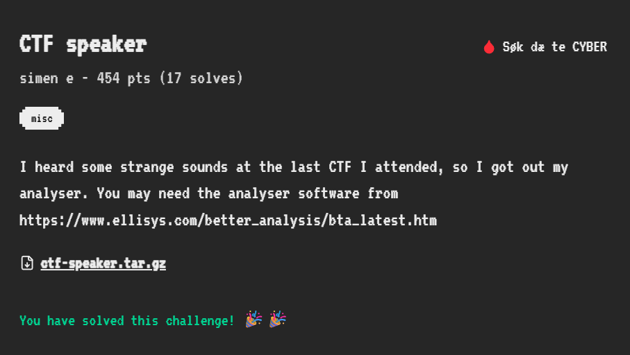
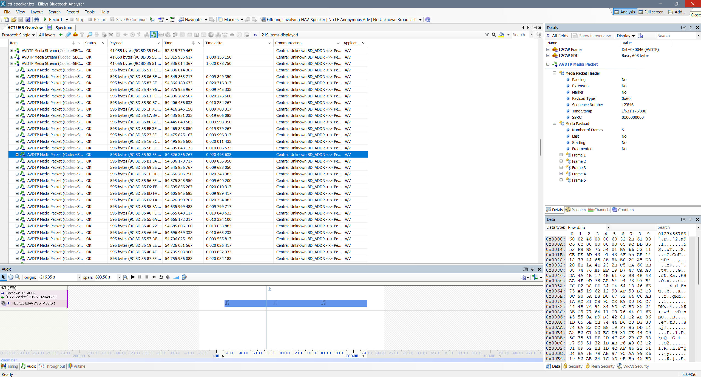
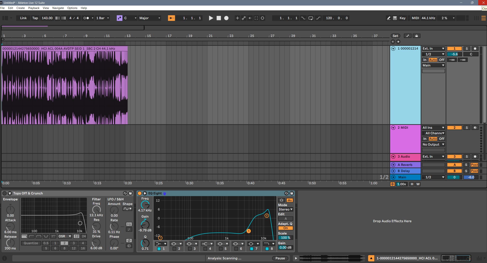
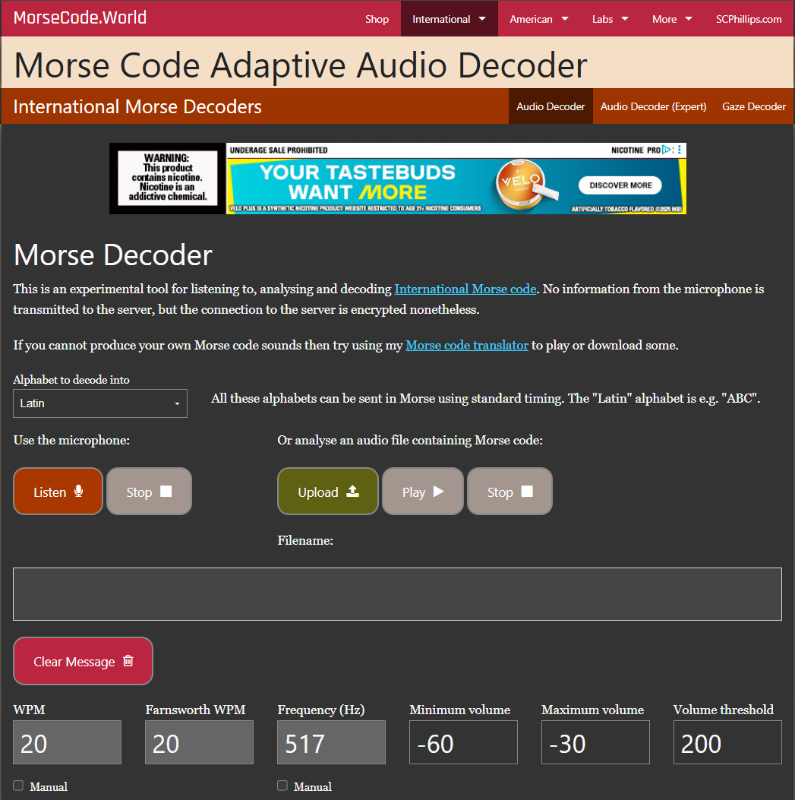
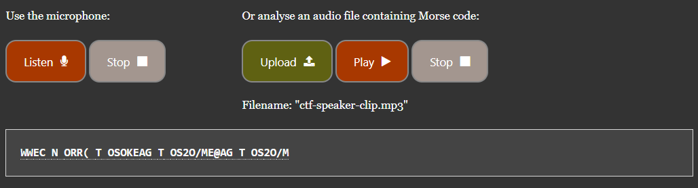

# 🎧 CTF Speaker — Write-Up

**Category:** Misc  
**Points:** 454  
**Solves:** 17  
**Flag Format:** `NNS{...}`  

---

## 📜 Challenge 

> I heard some strange sounds at the last CTF I attended, so I got out my analyser. You may need the analyser software from:  
> [Ellisys Better Analysis Tool](https://www.ellisys.com/better_analysis/bta_latest.htm)  

File provided: [`ctf-speaker.btt`](files/ctf-speaker.btt)

---

## 🔍 Step 1 — Inspecting the Capture

After extracting the archive, I found a `.btt` file. This format is a proprietary Bluetooth trace used by **Ellisys Bluetooth Analyzer**.

I opened the file in the [Ellisys Better Analysis](https://www.ellisys.com/better_analysis/bta_latest.htm) software and started examining the captured packets.

- Filtering the trace showed **AVDTP Media Packets**, which correspond to Bluetooth audio streaming.  
- The software’s **Audio playback feature** let me listen to the captured stream.  

---

## 🎶 Step 2 — Finding Suspicious Audio

Listening through the playback, I noticed that around the **65s–100s** mark there were **beeps** that didn’t sound like regular audio. These resembled **Morse code tones**.

Rather than trying to figure out how to export ONLY this segment of the audio in this software that I had never used before, I just exported the entire audio capture file. 

Download: [`ctf-speaker-full-audio.mp3`](ctf-speaker-full-audio.mp3)

---

## 🎛 Step 3 — Audio Processing

To isolate the Morse code section more clearly:

1. Loaded the exported [`ctf-speaker-full-audio.mp3`](ctf-speaker-full-audio.mp3) into **Ableton Live 12 Suite**.  
2. Trimmed the clip down to only the suspicious beeps.  
3. Verified that the tones were indeed structured enough to be Morse code.  

---

## 🔑 Step 4 — Decoding the Morse

I uploaded the clipped audio to [morsecode.world’s adaptive decoder](https://morsecode.world/international/decoder/audio-decoder-adaptive.html).

- At first, the live text decoder produced **gibberish** (random letters).  

- However, scrolling further down, the **spectrogram output** actually **drew letters visually**.

- Watching carefully while the audio played, the text became clear: it spelled out a CTF flag.  

  
  
  
  

---

## 🏁 Step 5 — The Flag

Finally, piecing everything together, the hidden message was: NNS{5n1ff1ng_HCI_tO_pl4y_sOund}

