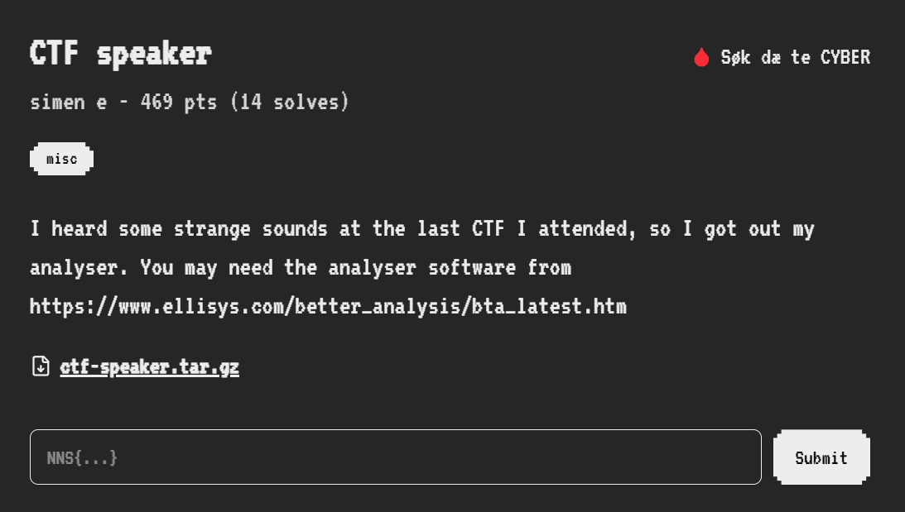
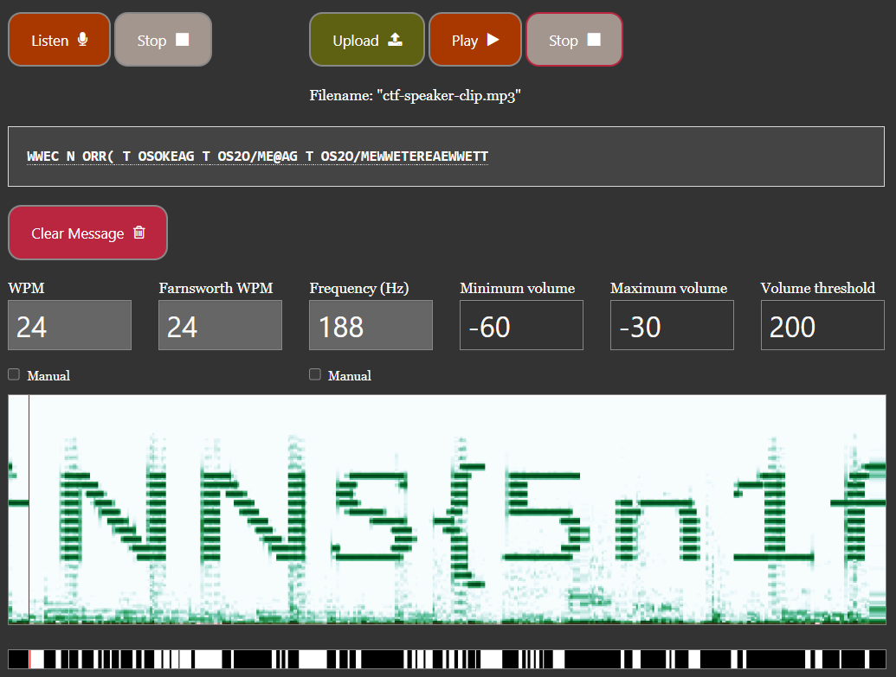

#  🎧 CTF Speaker — Write-Up

NNS CTF 2025

**Category:** Misc  
**Points:** 454   
**Flag Format:** `NNS{...}`  

---

## 📜 Challenge 

> "I heard some strange sounds at the last CTF I attended, so I got out my analyser. You may need the analyser software from:  
> [Ellisys Better Analysis Tool](https://www.ellisys.com/better_analysis/bta_latest.htm)"

File provided: [`ctf-speaker.btt`](files/ctf-speaker.btt)

---

## 🔍 Step 1 — Inspecting the Capture

After extracting the archive, I found a `.btt` file. This format is a proprietary Bluetooth trace used by **Ellisys Bluetooth Analyzer**.

I opened the file in the [Ellisys Better Analysis](https://www.ellisys.com/better_analysis/bta_latest.htm) software and started examining the captured packets.

- Filtering the trace showed **AVDTP Media Packets**, which which corresponds to Bluetooth audio streaming.  
- The software’s **Audio playback feature** let me listen to the captured stream.  

---

## 🎶 Step 2 — Finding Suspicious Audio

Listening through the playback, I noticed that around the **65s–100s** mark there were **beeps** that didn’t sound like regular audio. These resembled **Morse code tones**.

Rather than trying to figure out how to export ONLY this segment of the audio in this software (that I had never used before), I just exported the entire audio capture file. 

Full audio capture file: [`ctf-speaker-full-audio.mp3`](ctf-speaker-full-audio.mp3)

---

## 🎛 Step 3 — Audio Processing

To isolate the Morse code section more clearly:

1. Loaded the exported [`ctf-speaker-full-audio.mp3`](ctf-speaker-full-audio.mp3) into **Ableton Live 12 Suite**.  
2. Trimmed the clip down to only the suspicious beeps.  
3. Verified that the tones were indeed structured enough to be Morse code.  
4. EQ'd the audio so the beeps were more dominant in the audio file

5. Extracted 65s-100s from original audio export to a smaller, more digestable version

[`ctf-speaker-clip.mp3`](files/ctf-speaker-clip.mp3)

---

## 🔑 Step 4 — Decoding the Morse

I uploaded the clipped audio to [morsecode.world’s adaptive decoder](https://morsecode.world/international/decoder/audio-decoder-adaptive.html).

- At first, the live text decoder produced **gibberish** (random letters).  

- However, scrolling further down, the **spectrogram output** actually **drew letters visually**.

- Ther's the flag!  Watching carefully while the audio played, it spelled out the flag in the correct flag format `NNS{...}`  

  
  
  
   

---

## 🏁 Step 5 — Submit The Flag!

We got it!  After typing the flag into a text editor from watching it draw out while listening to the audio on [morsecode.world’s adaptive decoder](https://morsecode.world/international/decoder/audio-decoder-adaptive.html), I went ahead and submitted the flag.

That's it!  
`{5n1ff1ng_HCI_tO_pl4y_sOund}`

I had a great time solving this challenge.  Special thanks to my teammates at [Lil L3AK](https://ctftime.org/team/373171/) and [NNS CTF](https://nnsc.tf/) team for putting together some great challenges and overall, a fun and challenging CTF!

See you next year!

-[t4mpr](https://linkedin.com/in/smosillo)

